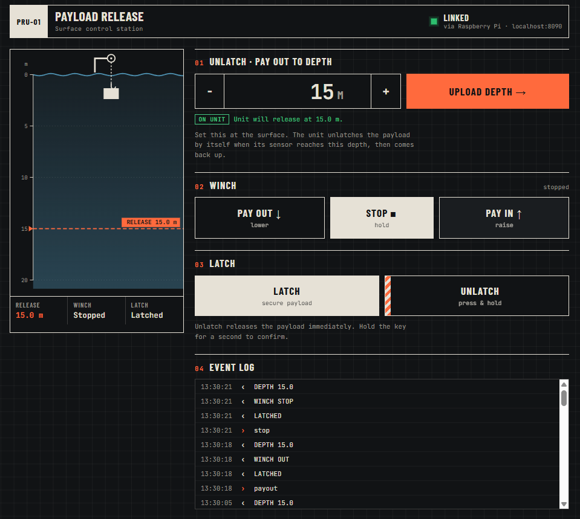

# Bluetooth ESP32 Interface

Surface control station for an ESP32-WROOM-32 payload release unit, over Bluetooth Low Energy (BLE).

- **Unlatch · pay out to depth**: upload the release depth at the surface. The unit unlatches by itself when its sensor reaches that depth, then comes back up. (Bluetooth doesn't work underwater, so the depth has to be uploaded before the unit goes down.)
- **Winch**: pay out, stop, pay in.
- **Latch / Unlatch**: manual latch control. Unlatch is press-and-hold so it can't be triggered by accident.

For now, latch turns the onboard LED (GPIO 2) **on** and unlatch turns it **off**. The winch and depth commands are received and reported back but don't drive any hardware yet.

